# Microprocesadores

## Práctica 1: Contador de 6 Bits y Caminata de LEDs con PIC16F887

### Descripción

En esta práctica se implementaron dos aplicaciones utilizando el microcontrolador PIC16F887: un contador binario de 6 bits y una caminata de LEDs.

| Cantidad | Componente |
|-----------|------------|
| 8 | LEDs |
| 8 | Resistencias de 330 Ω |
| 1 | Resistencia de 1 kΩ |
| 1 | PIC16F887 |
| 1 | Push Button |
| 1 | Cristal de cuarzo de 8 MHz |
| 1 | Fuente de alimentación de 5 V |

---

## Contador de 6 Bits

### Descripción

En esta sección de la práctica se desarrolló un contador de 6 bits que permite representar números binarios mediante el encendido y apagado secuencial de LEDs. Esta actividad permitió comprender el funcionamiento de las salidas digitales del microcontrolador.

### Simulación

Antes de realizar la implementación física, se utilizó Proteus para diseñar y verificar el funcionamiento del circuito. La simulación permitió validar las conexiones y el comportamiento esperado del sistema.

#### Simulación en Proteus

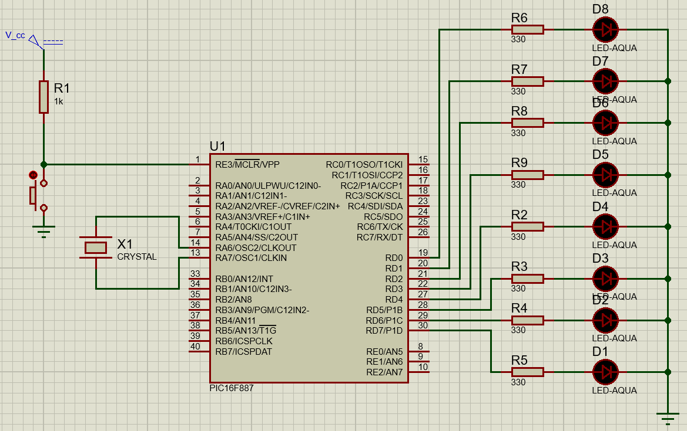

**Archivo de simulación:**  
[Descargar simulación](./Practica1/base_micro.pdsprj)

### Programación

La programación del PIC16F887 se realizó utilizando MPLAB. El código desarrollado controla el incremento del contador y la visualización de los estados binarios mediante los LEDs.

**Código en MPLAB:**  
[Ver código](./Practica1/Contador.c)

### Resultado

Una vez programado el microcontrolador y ensamblado el circuito, se obtuvo el funcionamiento esperado del contador binario de 6 bits.

#### Resultado físico

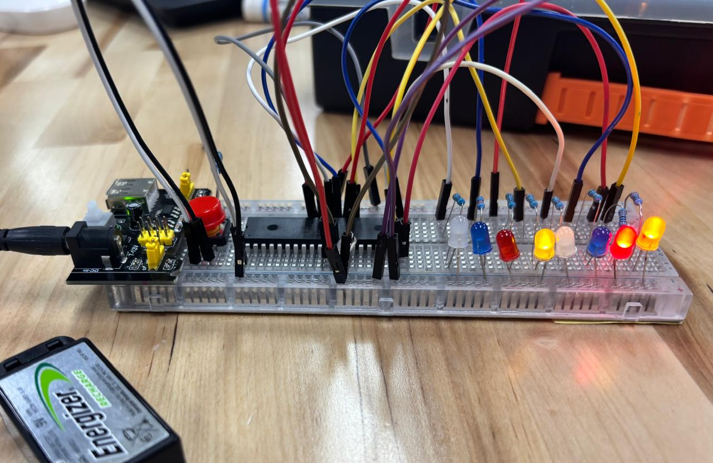

---

## Caminata de LED's

### Descripción

En esta actividad se desarrolló una caminata de LEDs utilizando los mismos componentes del montaje anterior. La secuencia consiste en encender un LED a la vez de forma consecutiva, generando el efecto visual de una luz desplazándose a través del arreglo de LEDs.

### Simulación

Al igual que en la actividad anterior, se empleó Proteus para verificar el correcto funcionamiento de la secuencia antes de la implementación física.

#### Simulación en Proteus

**Archivo de simulación:**  
[Descargar simulación](./Practica1/base_micro.pdsprj)

### Programación

La programación se realizó en MPLAB utilizando lenguaje C para controlar la secuencia de encendido y apagado de los LEDs.

 **Código en MPLAB:**  
[Ver código](./Practica1/Caminata.c)

### Resultado

Después de cargar el programa en el PIC16F887 y realizar las conexiones correspondientes, se obtuvo el efecto de caminata esperado.

#### Resultado físico

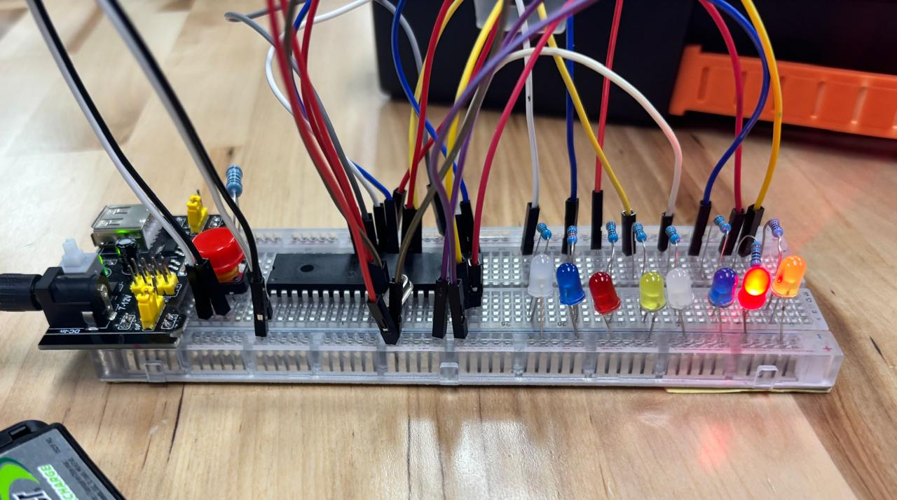

##  Práctica 2: Visualización de Letras en una Matriz de LEDs con PIC16F887

### Descripción

En esta práctica se utilizó el microcontrolador PIC16F887 para controlar una matriz de LEDs y mostrar diferentes letras mediante programación.

| Cantidad | Componente |
|-----------|------------|
| 1 | Matriz de LEDs |
| 1 | Resistencia de 1 kΩ |
| 1 | PIC16F887 |
| 1 | Push Button |
| 1 | Cristal de cuarzo de 8 MHz |
| 1 | Fuente de alimentación de 5 V |

---

## Iluminación de la Letra X

### Descripción

Para esta primera actividad se programó la matriz de LEDs para representar la letra X mediante un patrón específico de encendido y apagado de LEDs. Permitiendo entender la distribución de filas y columnas necesarias para generar caracteres en una matriz.

### Simulación

Antes de realizar la implementación física, se utilizó Proteus para diseñar y verificar el funcionamiento del circuito. La simulación permitió comprobar que la letra se mostrara correctamente en la matriz de LEDs.

#### Simulación en Proteus

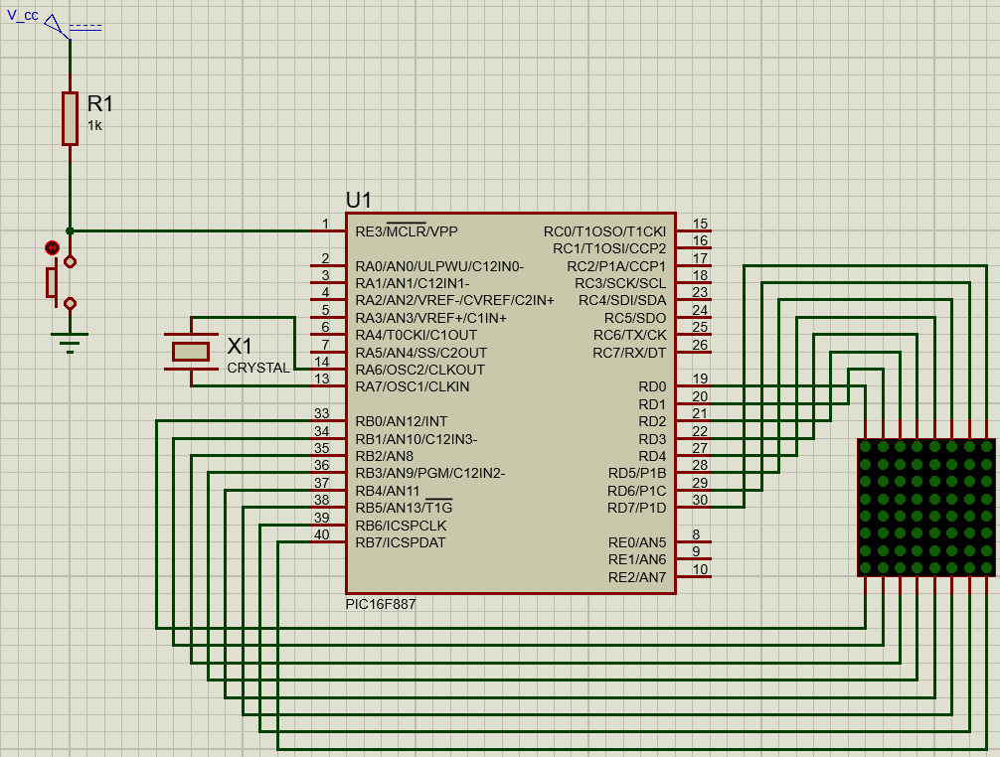

**Archivo de simulación:**  
[Descargar simulación](./Practica2/base_micro.pdsprj)

### Programación

La programación del PIC16F887 se realizó utilizando MPLAB. El código desarrollado define el patrón necesario para representar la letra X en la matriz de LEDs.

**Código en MPLAB:**  
[Ver código](./Practica2/X.c)

### Resultado

Después de programar el microcontrolador y realizar las conexiones correspondientes, se obtuvo la visualización correcta de la letra X en la matriz de LEDs.

#### Resultado físico

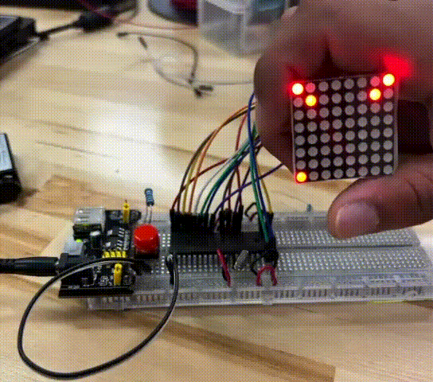

---

## Iluminación de las Letras A, N, K e I

### Descripción

Siguiendo el mismo procedimiento realizado para la letra X, se programaron nuevos patrones de iluminación para representar las letras A, N, K e I. Para ello únicamente fue necesario modificar el código correspondiente a cada patrón de encendido dentro de la matriz de LEDs.

### Simulación

Al igual que en la actividad anterior, se empleó Proteus para verificar el correcto funcionamiento de la secuencia antes de la implementación física.

#### Simulación en Proteus

**Archivo de simulación:**
[Descargar simulación](./Practica2/base_micro.pdsprj)

### Programación

La programación se realizó en MPLAB modificando los patrones de encendido para representar cada una de las letras en la matriz de LEDs.

 **Código en MPLAB:**  
[Ver código](./Practica2/ANKI.c)

### Resultado

Una vez cargado el programa en el PIC16F887 y realizadas las conexiones correspondientes, se logró visualizar correctamente las letras A, N, K e I en la matriz de LEDs.

#### Resultado físico

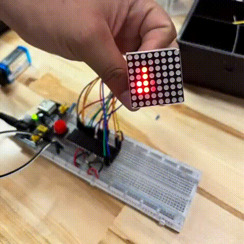

##  Práctica 3: Visualización de Números y Caracteres Hexadecimales en un Display de 7 Segmentos con PIC16F887

### Descripción

En esta práctica se utilizó el microcontrolador PIC16F887 para controlar un display de 7 segmentos y mostrar números decimales y caracteres hexadecimales. 

| Cantidad | Componente |
|-----------|------------|
| 1 | Display de 7 segmentos |
| 7 | Resistencias de 330 Ω |
| 1 | Resistencia de 1 kΩ |
| 1 | PIC16F887 |
| 1 | Push Button |
| 1 | Cristal de cuarzo de 8 MHz |
| 1 | Fuente de alimentación de 5 V |

---

## Visualización de Números del 0 al 9

### Descripción

Para esta primera actividad se programó el microcontrolador para mostrar de manera secuencial los números del 0 al 9 en el display de 7 segmentos. Permitiendo comprender cómo se controla cada segmento para formar los diferentes dígitos.

### Simulación

Antes de realizar la implementación física, se utilizó Proteus para diseñar y verificar el funcionamiento del circuito. La simulación permitió comprobar que la secuencia numérica se mostrara correctamente.

#### Simulación en Proteus

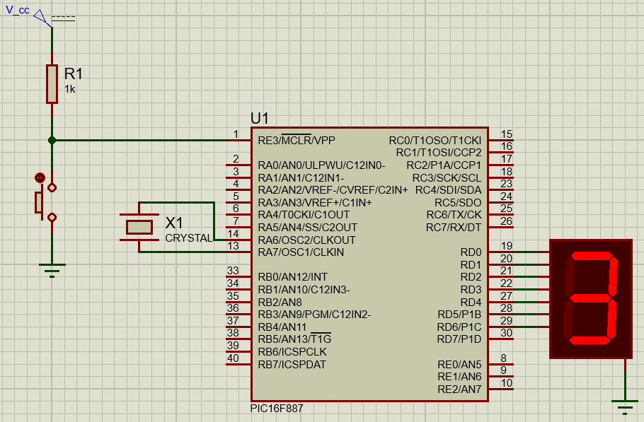

**Archivo de simulación:**  
[Descargar simulación](./Practica3/base_micro.pdsprj)

### Programación

La programación del PIC16F887 se realizó utilizando MPLAB. El código desarrollado controla los segmentos necesarios para representar cada número de la secuencia.

**Código en MPLAB:**  
[Ver código](./Practica3/Contador.c)

### Resultado

Después de programar el microcontrolador y realizar las conexiones correspondientes, se obtuvo la visualización correcta de la secuencia numérica del 0 al 9.

#### Resultado físico

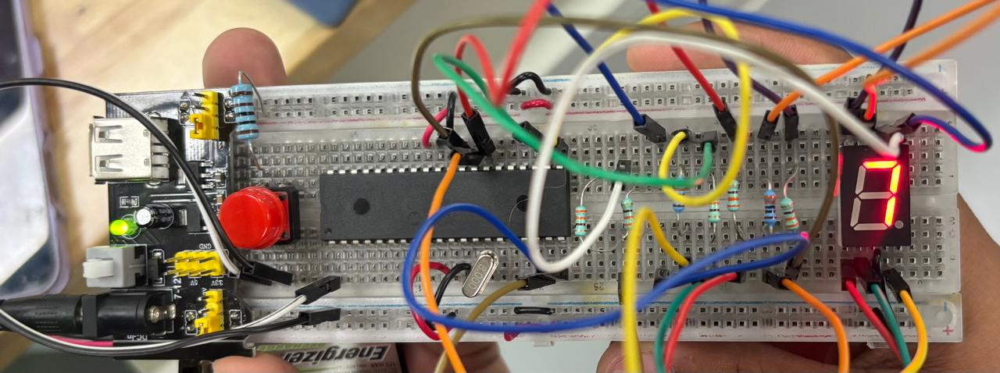

---

## Visualización de Caracteres Hexadecimales (0 a F)

### Descripción

Siguiendo el mismo procedimiento realizado para los números decimales, se modificó el programa para incluir los caracteres hexadecimales A, B, C, D, E y F. De esta manera se logró mostrar la secuencia completa de valores hexadecimales desde 0 hasta F.

### Simulación

Se utilizó Proteus para verificar el correcto funcionamiento de la secuencia hexadecimal antes de realizar la implementación física.

#### Simulación en Proteus

**Archivo de simulación:**  
[Descargar simulación](./Practica3/base_micro.pdsprj)

### Programación

La programación se realizó en MPLAB modificando los patrones de activación de los segmentos para representar las letras A, B, C, D, E y F en el display.

 **Código en MPLAB:**  
[Ver código](./Practica3/Todo.c)

### Resultado

Una vez cargado el programa en el PIC16F887 y realizadas las conexiones correspondientes, se logró visualizar correctamente la secuencia hexadecimal completa desde 0 hasta F.

#### Resultado físico

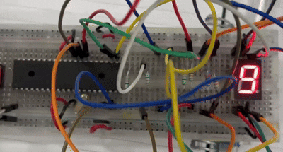

##  Práctica 4: Contador de 0 a 99 controlado con botones utilizando PIC16F887

### Descripción

En esta práctica se desarrolló un contador ascendente y descendente de 0 a 99 utilizando el microcontrolador PIC16F887 y dos displays de 7 segmentos. El sistema cuenta con botones que permiten incrementar o disminuir el valor mostrado.

| Cantidad | Componente |
|-----------|------------|
| 2 | Display de 7 segmentos |
| 1 | Resistencias de 1kΩ |
| 1 | PIC16F887 |
| 1 | Push Button |
| 1 | Cristal de cuarzo de 8 MHz |
| 1 | Fuente de alimentación de 5 V |

---

### Funcionamiento 

El sistema utiliza tres botones principales para controlar el contador: 
- **Botón de incremento:** aumenta el valor mostrado.
- **Botón de decremento:** disminuye el valor mostrado.
- **Botón selector:** permite seleccionar el tamaño del incremento o decremento.

| Estado del selector | Incremento | Decremento |
|--------------------|------------|------------|
| OFF | +1 | -1 | 
| ON | +2 | -2 |

El contador funciona dentro del rango de 0 a 99, mostrando el valor actual en dos displays de 7 segmentos.

### Simulación

Antes de realizar la implementación física, se utilizó Proteus para diseñar y verificar el funcionamiento del circuito. La simulación permitió validar el comportamiento de los botones, los displays y contador.

#### Simulación en Proteus

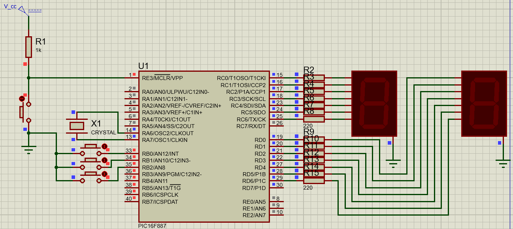

**Archivo de simulación:**  
[Descargar simulación](./Practica4/base_micro.pdsprj)

### Programación

La programación del PIC16F887 se realizó utilizando MPLAB. El código desarrollado controla los segmentos necesarios para representar los distintos modos.

**Código en MPLAB:**  
[Ver código](./Practica4/Contador.hex)

### Resultado

Después de programar el microcontrolador y realizar las conexiones correspondientes, se obtuvo un contador funcional capaz de incrementar y decrementar valores entre 0 y 99.

#### Resultado físico

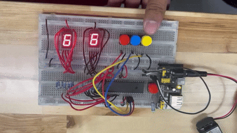

##  Práctica 6: Manejo de LCD con PIC16F887

### Descripción

En esta práctica se utilizó el microcontrolador PIC16F887 para controlar una pantalla LCD alfanumérica. Como primera parte, se mostraron mensajes predeterminados, incluyendo la frase "Hola Mundo" y el abecedario. Posteriormente, se creó un carácter personalizado mediante programación y se implementó un sistema que permite alternar entre dos mensajes utilizando un botón.

| Cantidad | Componente |
|-----------|------------|
| 1 | Pantalla LCD |
| 1 | Resistencia de 330 Ω |
| 1 | PIC16F887 |
| 1 | Push Button |
| 1 | Cristal de cuarzo de 8 MHz |
| 1 | Fuente de alimentación de 5 V |

---

### Visualización de Mensajes en LCD 

En esta primera actividad se configuró la pantalla LCD para mostrar diferentes cadenas de texto. Inicialmente se desplegó la frase **"Hola Mundo"** y posteriormente el abecedario completo, permitiendo comprender el envío de caracteres y el manejo básico de la pantalla.

### Simulación

Antes de realizar la implementación física, se utilizó Proteus para diseñar y verificar el funcionamiento del circuito. La simulación permitió comprobar la correcta visualización de los mensajes en la pantalla LCD.

#### Simulación en Proteus

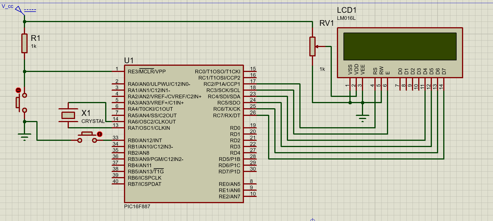

**Archivo de simulación:**  
[Descargar simulación](./Practica6/base_micro.pdsprj)

### Programación

La programación del PIC16F887 se realizó utilizando MPLAB. El código desarrollado inicializa la pantalla LCD muestra los mensajes programados.

**Código en MPLAB:**  
[Ver código](./Practica6/Hello.hex)

### Resultado

Después de realizar las conexiones y cargar el programa en el microcontrolador, se logró visualizar correctamente la frase "Hola Mundo" y el abecedario en la pantalla LCD.

#### Resultado físico

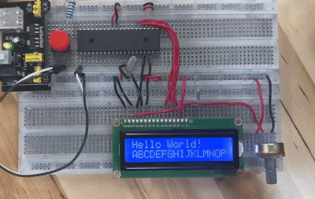

### Creación de un Carácter Personalizado y Cambio de Mensajes 

En esta  actividad se utilizó la memoria CGRAM de la pantalla LCD para diseñar y almacenar un carácter personalizado. Además, se implementó una función que permite alternar entre dos mensajes distintos.

### Programación

La programación se realizó en MPLAB definiendo el patrón del carácter personalizado y desarrollando la lógica para el cambio del mensaje mostrado en pantalla.

**Código en MPLAB:**  
[Ver código](./Practica6/Casita.hex)

### Resultado

Una vez cargado el programa y realizadas las conexiones correspondientes, se muestra el carácter personalizado.

#### Resultado físico

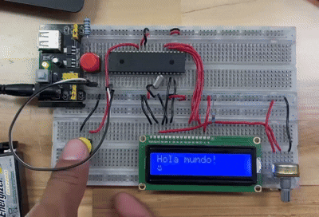

#### Firma de Honor:
Damos nuestra palabra de que hemos realizado esta actividad con integridad académica
